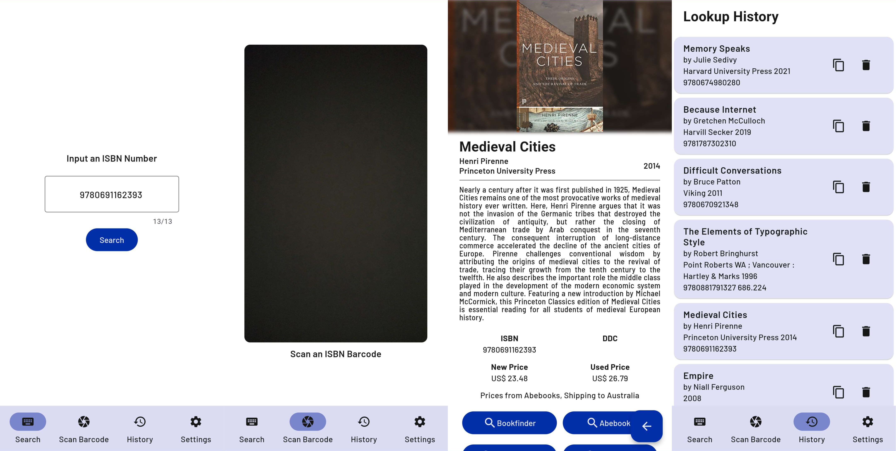
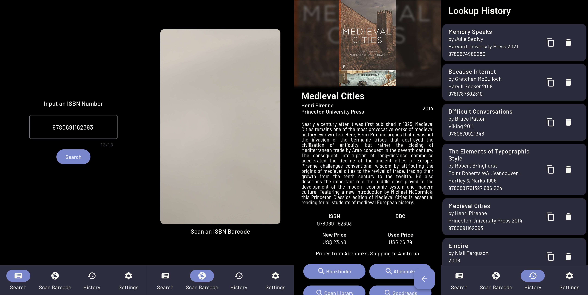

# ISBN Lookup

ISBN Lookup is an intuitive and user-friendly Flutter application designed to simplify the process of searching for books using their ISBN (International Standard Book Number). This application is perfect for book enthusiasts, librarians, and anyone in need of quick and accurate book information.

## Key Features

- ISBN Validation: Ensures the ISBN entered is in a valid format, supporting both ISBN-10 and ISBN-13.
- Barcode Scanning: Utilises the device's camera for scanning ISBN barcodes, making the search process effortless.
- Search History: Keeps track of your previous searches, allowing easy access to past queries.
- Customisable Settings (coming soon): Tailor the app to your preferences, enhancing your search experience.
    Elegant UI: A clean and modern interface, with a focus on usability and readability.

## Screenshots

